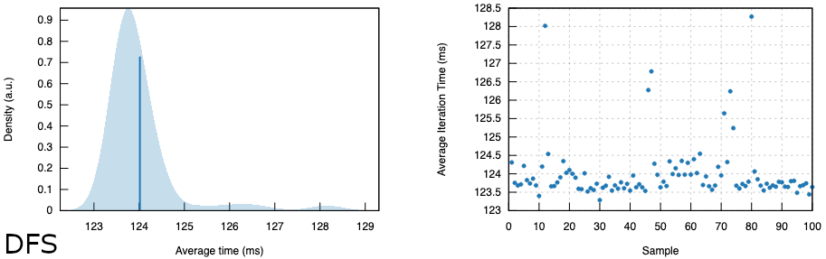
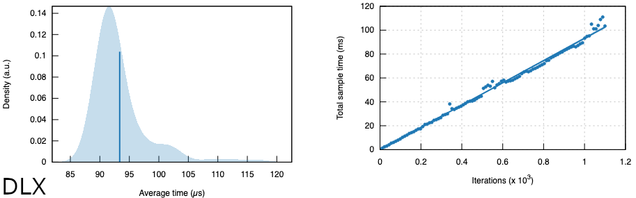
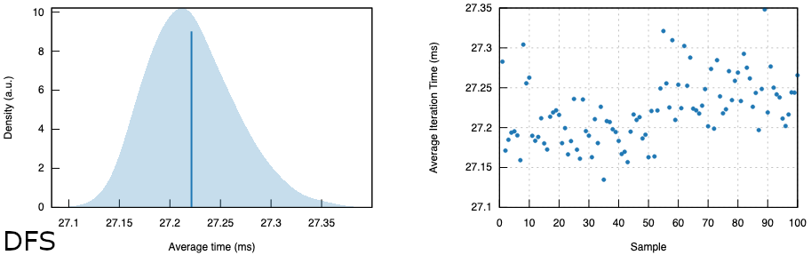
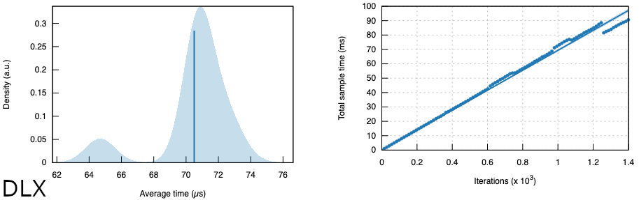
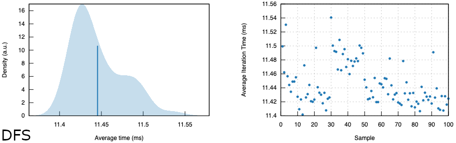
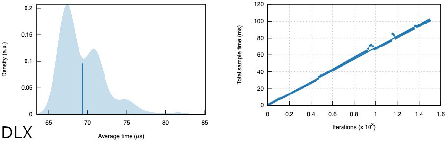

# HTTP API backend for a Sudoku solver

## Setup

```shell
# Install the 'pre-commit-rust' hook
$ pre-commit install
# Build & run
$ cargo build --release
$ ./target/release/pure-be
```

By default the server will be listening for requests on `localhost:8080`. The default configuration can be modified using the following environment variables:

- `RUST_LOG`: Logging level of `env_logger` (defaults to `info`)
- `MODE`: Interface of the listening socket (`prod` -> `0.0.0.0`, defaults to `127.0.0.1`)
- `PORT`: Port of the listening socket (defaults to `8080`)
- `QUOTA_REPLENISH_INTERVAL_S`: Interval after which one element of the quota is replenished in seconds (defaults to `60`)
- `BURST_SIZE`: Quota size that defines how many requests can occur before the governor middleware starts blocking requests (defaults to `3`)

## Usage

The API contains a single solver endpoint: `/solve`. The specific algorithm can be selected with either of the following strings as the `solver` input field's value. If the field isn't included into the request or it contains an invalid value the `dlx` option will be used by default, as it's magnitudes faster as the [benchmarks](#performance) indicate.

- `dfs`: Starts by applying Arc Consistency Algorithm #3 (constraint propagation) & then continues with backtracking Depth First Search enhanced with Minimum Remaining Value heuristic and Forward Checking
- `dlx`: Starts by converting the given Sudoku into an exact cover problem, which is then solved using Donald Knuth's Algorithm X, which utilizes the dancing links technique

The endpoint parses the Sudokus from the following request payload format: a JSON array of stringified 1D grids (empty cells represented with `0`):

```json
[
  {
    "grid": "500000010020007000000010000000200604100005000800000000090400200000380000000000700",
    "solver": "dfs|dlx"
  }
]
```

## Performance

Benchmarks are produced using [criterion](https://crates.io/crates/criterion) and a few randomly picked samples from Gordon Royle's [collection](https://web.archive.org/web/20120730100322/http://mapleta.maths.uwa.edu.au/~gordon/sudokumin.php) of 49151 distinct Sudoku configurations.

<details>
<summary>Sample 1</summary>


</details>

<details>
<summary>Sample 2</summary>


</details>

<details>
<summary>Sample 3</summary>


</details>

## Roadmap

- [x] Backtracking [DFS](https://web.archive.org/web/20221208212421/https://www.dcc.fc.up.pt/~acm/sudoku.pdf) solver
  - [x] AC-3 constraint propagation beforehand
  - [x] MRV heuristic and Forward Checking
- [x] Integration tests with randomized payloads picked from Gordon Royle's collection (`sudoku17`)
- [x] Improved error propagation to server responses & internal logging
- [x] Docs: Randomized benchmarks with [criterion](https://crates.io/crates/criterion)
- [x] IP based rate limiting with [governor](https://crates.io/crates/governor)
- [x] Performance metadata of the solver process embedded into the server response
- [x] [Knuth's Algorithm X](https://en.wikipedia.org/wiki/Knuth%27s_Algorithm_X) (exact cover) solver
